# 🚀 PilotCap – Plateforme de mise en relation Investisseurs ↔ Entreprises

**PilotCap** est une plateforme web innovante qui facilite la mise en relation entre les investisseurs à la recherche d'opportunités rentables et les entreprises souhaitant lever des fonds pour développer leurs projets.

---

## 🎯 Objectif du projet

Permettre une collaboration fluide et sécurisée entre deux types d’utilisateurs :

- **Entreprises** qui publient leurs besoins en financement et reçoivent des propositions d'investissement.
- **Investisseurs** qui consultent les opportunités et proposent des offres personnalisées.

Le projet repose sur une architecture **frontend Angular + backend Node.js microservices**, avec un stockage des données dans **MongoDB**.

---

## 👥 Rôles utilisateurs

### 🏢 Entreprise
- Crée un profil avec ses informations et son portefeuille
- Publie des **opportunités de financement**
- Consulte les **propositions reçues** et peut **accepter/refuser**

### 💼 Investisseur
- Crée un compte
- Parcourt les **opportunités** publiées
- Envoie des **propositions d’investissement personnalisées**
- Suit l'état de ses propositions (en attente, acceptée, refusée)

---

## 🖥️ Interfaces principales

### Interface Investisseur
- 🔐 Login / Signup
- 📋 Liste des opportunités
- 📨 Formulaire d’envoi de proposition
- 📈 Dashboard des investissements envoyés

### Interface Entreprise
- 🔐 Login / Signup
- 🧾 Formulaire de publication d’opportunités
- 🗃️ Tableau des propositions reçues
- 🛠️ Gestion du **profil entreprise**

---

## 🧩 Fonctionnalités clés

- Authentification par rôle (JWT + middlewares)
- Tableau de bord dynamique
- Système de publication et de réponse aux opportunités
- Contrôle d'accès selon le rôle utilisateur
- Design responsive moderne avec **Tailwind CSS**

---

## 🛠️ Technologies principales

| Côté            | Stack                                      |
|-----------------|--------------------------------------------|
| **Frontend**    | Angular 15+, Tailwind CSS, Font Awesome     |
| **Backend**     | Node.js, Express.js, MongoDB, JWT, Mongoose |
| **Arch. backend** | Microservices modulaires (User, Entreprise, Investment, etc.) |

---

## 🗂️ Structure du projet
- frontend
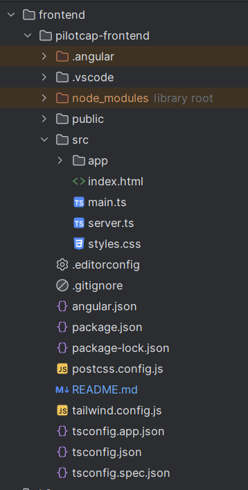
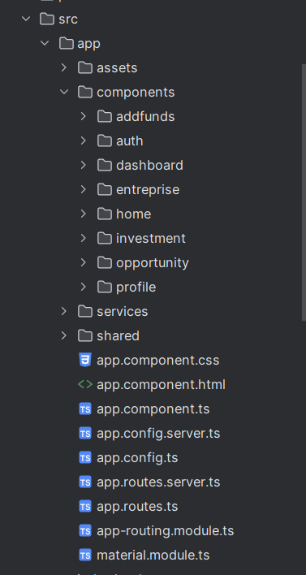
- backend
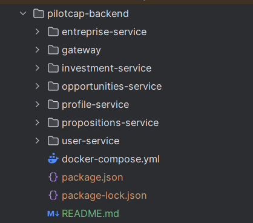
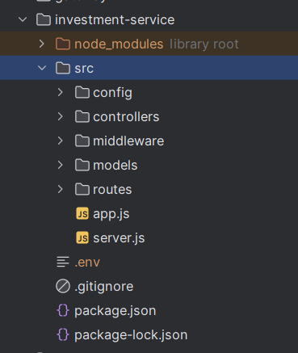

## 📦 Démarrage local
1. **Backend** : Démarrer chaque microservice 
   ```bash
   cd pilotcap-backend
   cd user-service
   npm install
   npm run dev
2. **Frontend** :
   ```bash
   cd frontend
   npm install
   ng serve


## 🖥️ Interfaces
- Authentification

- Inscription
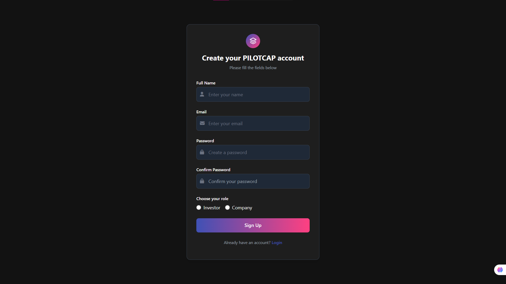
- Page d'accueil
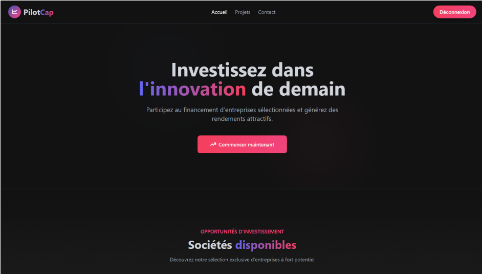
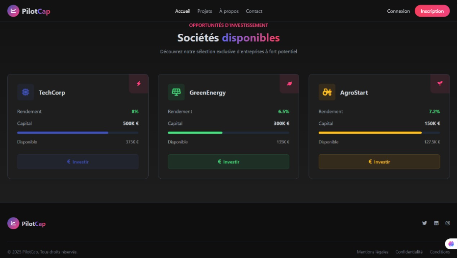
- Dashboard Investisseur
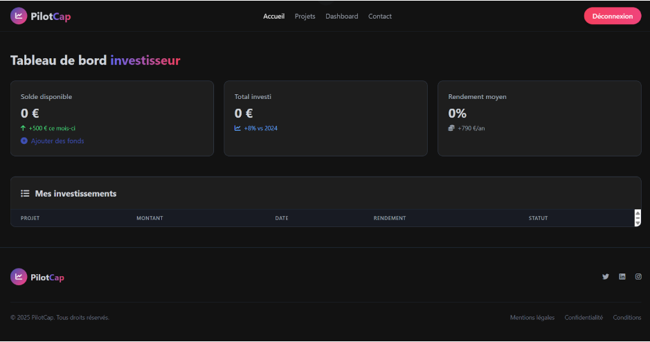
- Ajouter des fonds
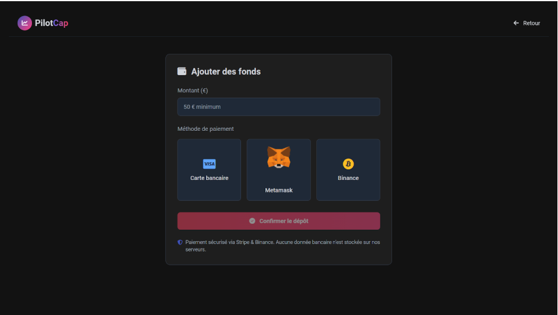
- Page des opportunités d'ivestissements
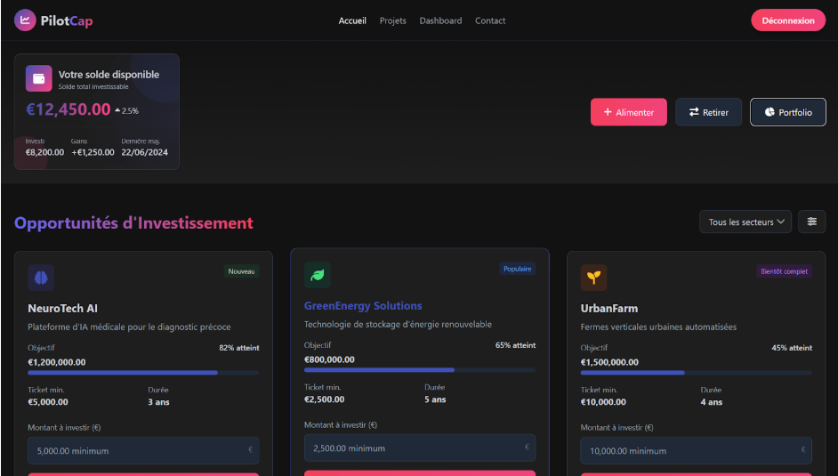
- Profil de l'entreprise
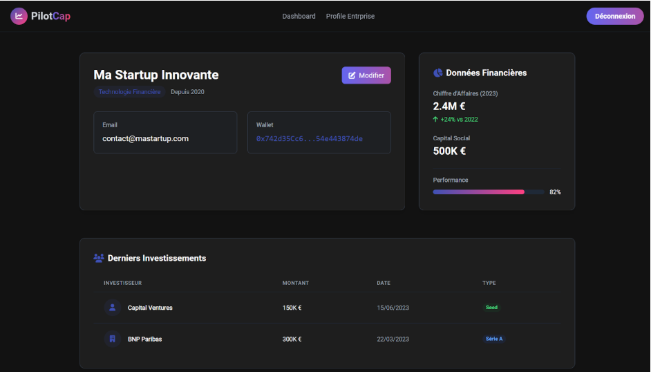
- Propositions reçues

- Creation d'opportunité
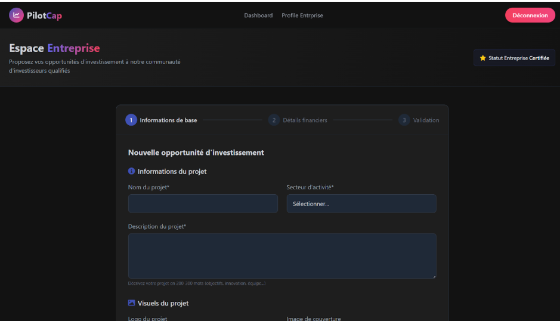
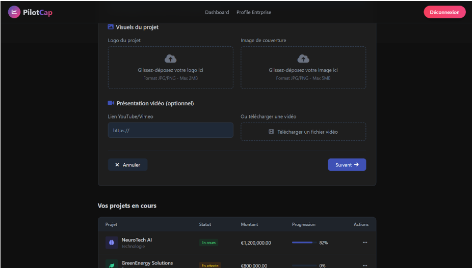